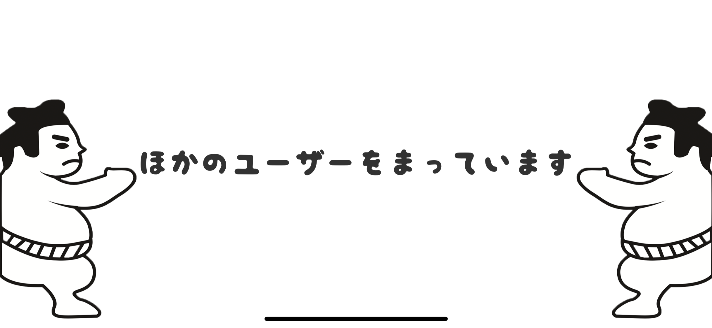

# ばとるうぇーぶ

## 製品概要
### コミュニケーション ×  Tech

### 背景
現在, スマホを中心とした生活が当たり前になってきている. 多くの店舗ではスマホ決済が導入され支払いが手軽になったり, 専用アプリを入れることで, お得なクーポンを取得できるようになるなど, スマホが欠かせない時代になった.
しかし, スマホで便利な世の中になると同時に, 人とコミュニケーションを取る機会も少なくなったといえるのではないだろうか？
道に迷えば地図アプリを開き, 旅行をしたときには何がおすすめかをスマホで調べ, 一人のときは, アプリで音楽を聴いたり, 漫画を読んだり, 動画を見るなど一人でも時間をつぶせるようになった. このようにスマホが普及する前と比べて一人の時間が増え, 人と直接触れ合う時間が少なくなっている. その結果, 他人はもちろん家族間でのコミュニケーションも以前より少なくなっている. 特に スマホの扱いに不慣れで 家族と遠く離れて暮らす高齢者は, 以前よりも家族と直接コミュニケーションを取ることが難しい.

そこで, 遠く離れて暮らす高齢者とその家族を対象に **「遊び」** を介してコミュニケーションを取ろうと考えた.

「遊び」は基本的に二人以上でやるため, コミュニケーションが必須である.  また遊んでいると思わぬハプニングがあった場合や, 気持ちが高ぶった場合などに自然と声を出すことがある. そのため, 常に会話をしながら遊ぶため, 円滑なコミュニケーションを取ることができ, スマホ普及によるコミュニケーション不足をなくすことが出来る.

### 製品説明
「ばとるうぇーぶ」は トントン相撲をベースとした, 遠隔コミュニケーションシステムである.

スマホ操作に不慣れな高齢者・児童でも簡単に操作できるUI/UXが必要なため, IoTデバイスをコントローラとして用いることで, 直感的にアプリを操作でき,「遊び」を介しながらコミュニケーションを取ることが可能である.

### 特長

#### 1. 普段は遠く離れて暮らす家族と, 「遊び」を介しながら会話ができるため, 隣にいるような感覚で楽しむことができる.

#### 2. スマホの扱いに不慣れな人でも直感的に操作可能なIoTデバイスを使用している. そのため, 「スマホ操作は難しい」という認識を変えることができ, スマホに対するハードルを下げることができる.

#### 3. トントン相撲を題材にしたアプリケーション

今回遊びの例としたトントン相撲は世代間でも一定のレベルで認知度が高く, トントン相撲を題材とした[様々なイベント](https://megahouse.co.jp/megatoy/products/item/2535/)が確認できることからアプリの導入が自然となることが予測できる.

### 解決出来ること
* 遊びを通して遠く離れて暮らす家族間でも楽しみながら遊べるため, スマホ普及による家族間のコミュニケーション不足の解消

### 今後の展望
* AR技術を組み合わせ, 現実空間にゲームフィールドを投影.
* ゲーム性に合わせたデザインの3Dモデルの作成
* 家族全員でも対戦可能にすること, また,そのためのルール設定.

## 開発内容・開発技術
### 活用した技術
#### API・データ
* infineonの音圧計とXMCボード

#### フレームワーク・ライブラリ・モジュール
* Unity(Photon, Vuforia)
* Raspberry Pi

#### デバイス
* iOS

### 独自開発技術（Hack Dayで開発したもの）
#### 2日間に開発した独自の機能・技術
* serialポートを用いたセンサー情報取得と他デバイスへの送信 
 [(commit ID : 17245be6117899276485972265320a862da41917)](https://github.com/jphacks/FK_1904/commit/17245be6117899276485972265320a862da41917)

 [infineon microphone(Sponsor提供)](https://www.infineon.com/cms/jp/product/sensor/mems-microphones/)の値を [XMCボード](https://www.infineon.com/cms/en/product/evaluation-boards/kit_xmc_2go_xmc1100_v1/)のserialポートへ出力. その出力をRaspberry Piで取得し, IFTTT, IntegromatにPOST送信を可能にした.  
 ※ 従来技術はserialポートからの取得, 描画までだった.

* 3Dモデルのモーション作成 
 本プロダクトで用いるモーションは配布assetにはない姿勢だったため自作した.
